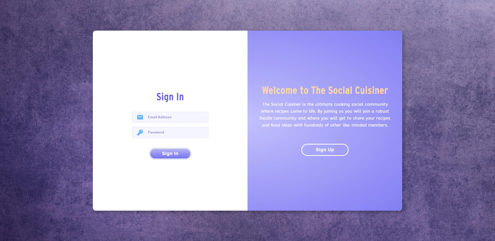
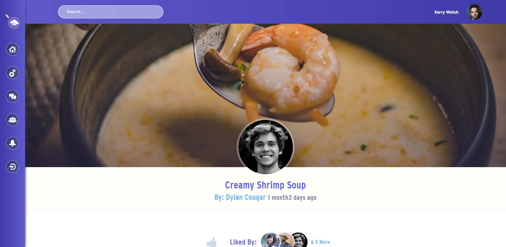
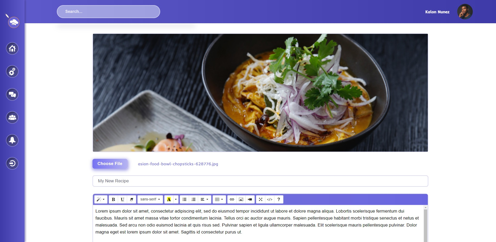
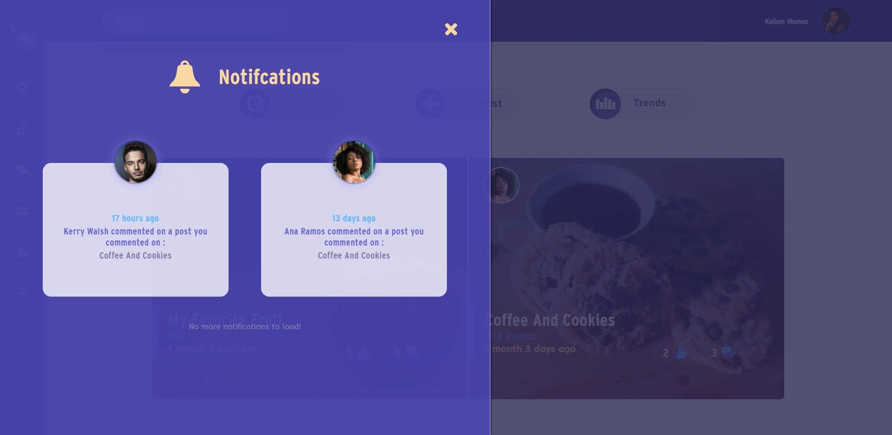
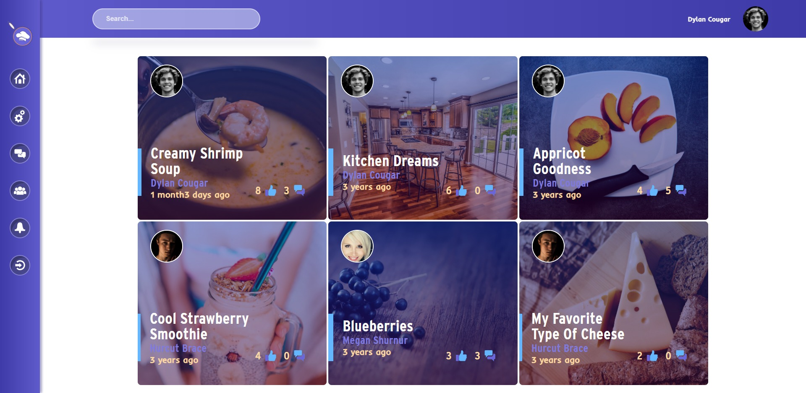
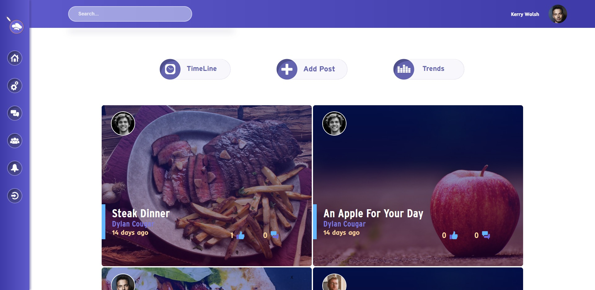
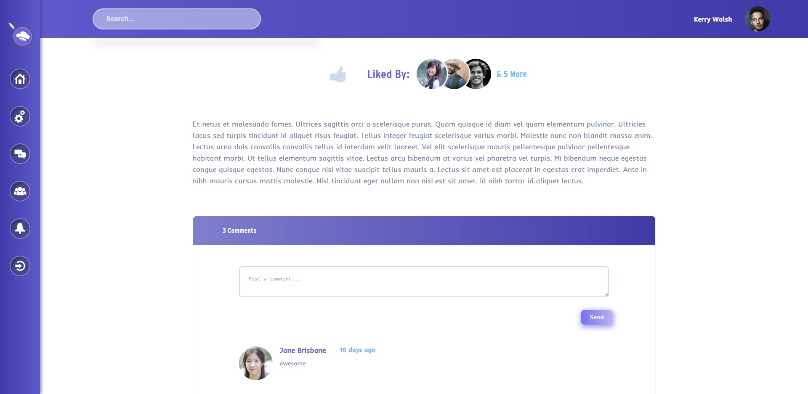
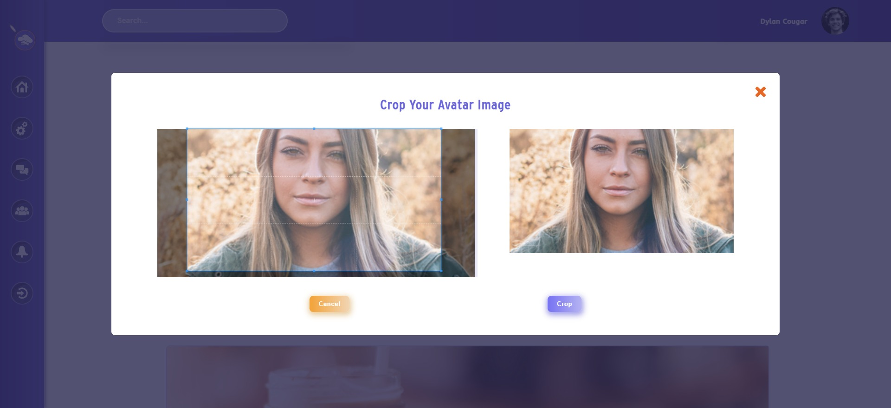
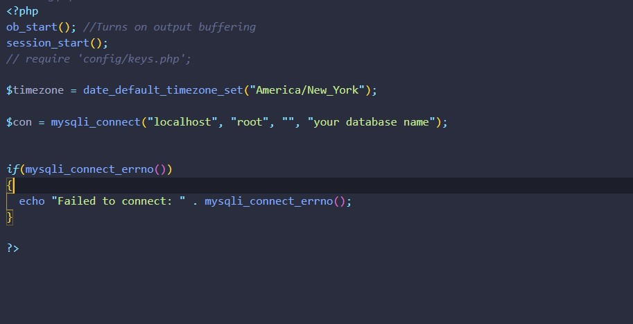

# The Social Cuisiener

# 

This is a very simple fictional social network project that focuses on the love of food and recipe sharing. The front end is simple HTML/CSS and some JavaScript, while the back-end is vanilla PHP, no framework. This was originally put together a few years ago. And has recently undergone a major redesign. 

|  |  |
| ----------- | ----------- |
|      |       |
|      |       |
|      |       |
|      |       |

## Getting Started

To check this out for yourself. Download the files, create a database, or use the social2021.sql file to create a database, that's already prepopulated with users. Open up the config.php file in the config folder. Then added your database credentials such as name and password.

### Prerequisites

A localhost Xamp, Wamp etc. And Php installed on your machine.

## Built With

* [PHP]
* [JavaScript]
* [Axios]
* [JQuery]
* Stock photos from (https://www.pexels.com/)
