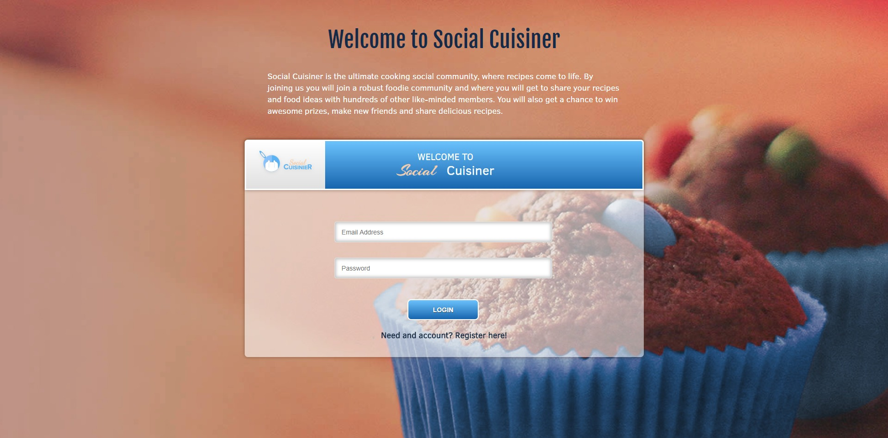

# 

# Social Cuisiener

A very simple fictional social network project, that focuses on the love of food and recipe sharing. The front end is simple
HTML/CSS and some JavaScript, while the back-end is vanilla PHP,no framework. This project has enabled me to increase my skills
 in JavaScript, and PHP. To view without creating a new user, use these login details (user:dylancougar@yahoo.com) ,
 (password:panther).

## Getting Started

To check this out for yourself. Download the files, create a database, or use the social.sql file to create a database, that's already prepopulated with users

### Prerequisites

A localhost Xamp, Wamp etc. And Php installed on your machine.

## Built With

* [PHP]
* [JavaScript]
* [JQuery](https://jquery.com/)
* Stock photos from (https://www.pexels.com/)
